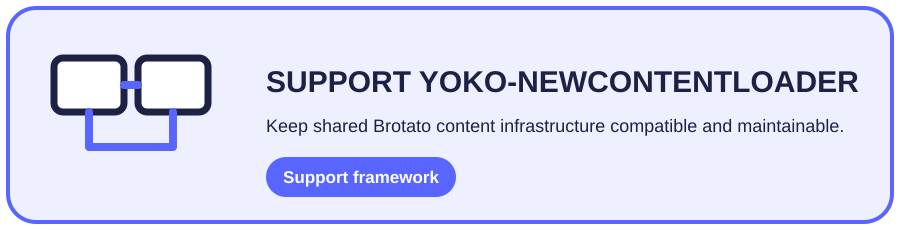

<div align="center">
  <h1>Yoko-NewContentLoader</h1>
  <p><strong>Shared content-registration infrastructure for Brotato Mod Loader projects.</strong></p>
  <p>Structured resources · Lifecycle management · Runtime extensions · Mod interoperability</p>
  <p>
    <a href="https://github.com/CYoJkoY/Yoko-NewContentLoader/releases"></a>
    <a href="https://github.com/CYoJkoY/Yoko-NewContentLoader/actions/workflows/release.yml"></a>
    
    
    <a href="LICENSE"></a>
  </p>
  <p><a href="#why-it-exists">Overview</a> · <a href="#content-model">Content</a> · <a href="#integration">Integration</a> · <a href="#installation">Install</a> · <a href="#development--support">Development</a></p>
</div>

> **Core boundary:** dependent mods describe content as Godot resources; NewContentLoader owns registration and lifecycle integration; Brotato remains the runtime owner of gameplay behavior.

##  Why it exists

Brotato content mods repeatedly need to register many resources with existing game services while retaining a clean way to refresh or remove them. **Yoko-NewContentLoader** provides that shared boundary.

```text
Dependent mod → NewContent resource → registration/lifecycle → Brotato services
```

It is infrastructure, not another gameplay framework.

##  Content model

`NewContent` groups resources a dependent mod wants to register.

| Area | Supported content |
| :--- | :--- |
| Gameplay | Characters, enemies, elites, bosses, items, weapons, effects, consumables, upgrades, sets |
| World | Backgrounds, zones, difficulties, title-screen backgrounds |
| Progression | Challenges, tracked items/effects, stat metadata |
| Localization | Translation resources and localized content |
| Runtime | Scene, player, enemy, and effect behaviors |

`add_resources()` and `remove_resources()` form the paired lifecycle contract.

##  Integration

The loader extends selected Brotato systems, including `ProgressData`, `RunData`, `Utils`, `Main`, `WeaponService`, `FloatingTextManager`, and `ItemService`.

Dependent mods can also expose class services through `extensions/services/class_service.gd`.

The important rule is ownership: extend the service that owns the behavior instead of creating a parallel system.

##  Installation

Requirements: **Brotato 1.15.4** and **Brotato Mod Loader 6.3.0**.

Download the latest `NewContentLoader-*.zip` from [Releases](https://github.com/CYoJkoY/Yoko-NewContentLoader/releases) and place it in the Mod Loader `mods` directory before enabling dependent mods.

Development layout:

```text
mods-unpacked/
└── Yoko-NewContentLoader/
    ├── extensions/
    ├── NewContent.gd
    ├── NewContent.tres
    ├── manifest.json
    └── mod_main.gd
```

##  Development & support

Treat this repository as shared framework code. Changes to registration order, removal behavior, global class state, or service lookups can affect every dependent mod; test the complete stack.

`manifest.json` is authoritative for version **1.1.0** and compatibility.

<a href="https://cyojkoy.github.io/Payment/"></a>

Development support: **https://cyojkoy.github.io/Payment/**

## License

This project is licensed under the [MIT License](LICENSE).
